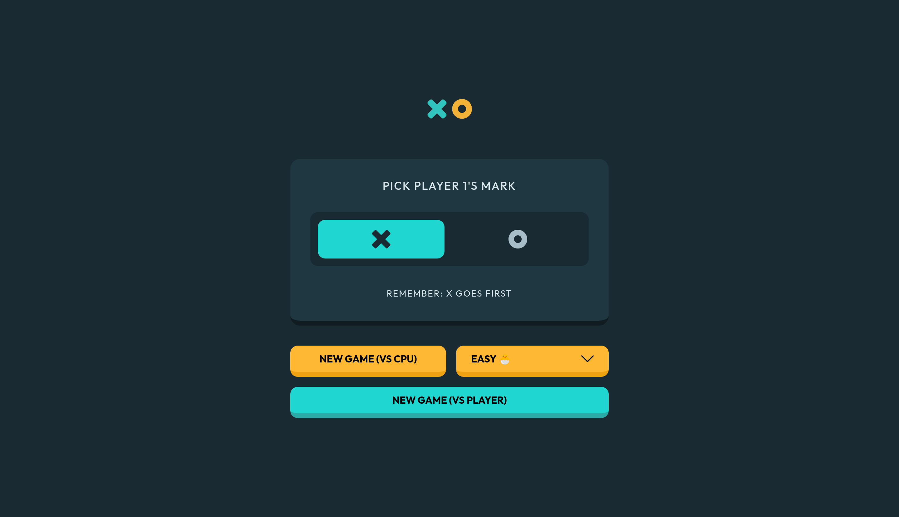
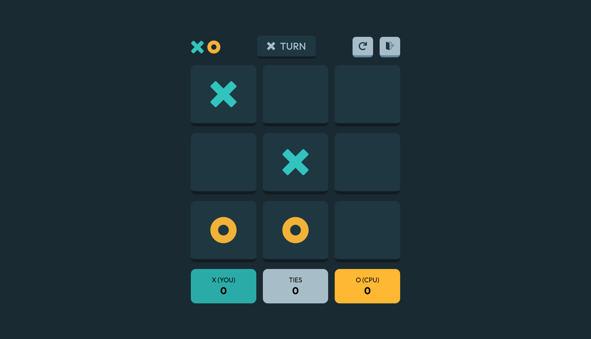
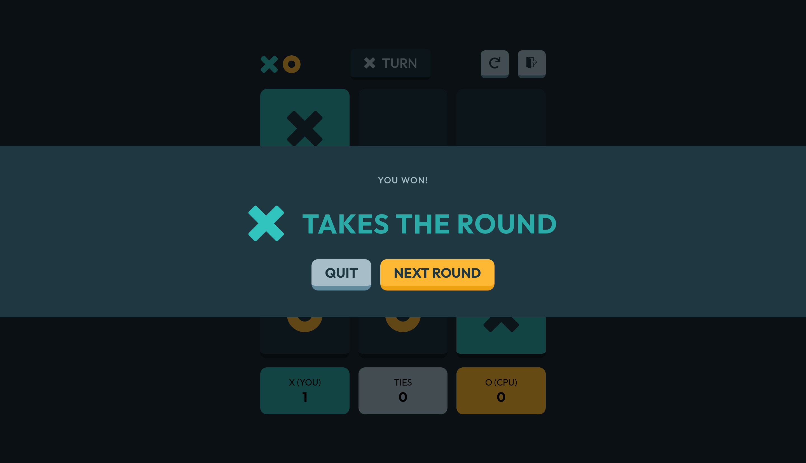

# Frontend Mentor - Tic Tac Toe Game solution

This is a solution to the [Tic Tac Toe game challenge on Frontend Mentor](https://www.frontendmentor.io/challenges/tic-tac-toe-game-Re7ZF_E2v). Frontend Mentor challenges help you improve your coding skills by building realistic projects.

## Table of contents

- [Overview](#overview)
  - [The challenge](#the-challenge)
  - [Screenshot](#screenshot)
  - [Links](#links)
- [My process](#my-process)
  - [Built with](#built-with)
  - [What I learned](#what-i-learned)
  - [What I added](#what-i-added)
  - [Continued development](#continued-development)
  - [Useful resources](#useful-resources)

## Overview

### The challenge

Users should be able to:

- View the optimal layout for the game depending on their device's screen size
- See hover states for all interactive elements on the page
- Play the game either solo vs the computer or multiplayer against another person
- Bonus 1: Save the game state in the browser so that it’s preserved if the player refreshes their browser
- Bonus 2: Instead of having the computer randomly make their moves, try making it clever so it’s proactive in blocking your moves and trying to win

### Screenshot

### Links

- Solution URL: [News Homepage](https://www.frontendmentor.io/solutions/responsive-news-homepage-with-using-grid-and-subgrid-layout-lL3tqWv7-M)
- Live Site URL: [News Homepage](https://fem-news-homepage-woad.vercel.app/)

## My process

### Built with

- Semantic HTML5 markup
- CSS custom properties
- Flexbox
- CSS Grid
- Mobile-first workflow
- [Vite](https://vite.dev/guide/) - Build tool

### What I learned

- Learned about building game logic from scratch.
- Learned about how to do state management and cautious about changing it accidently.
- Learned about how to split functionality to workflow functions, logic functions and helper functions
- Learned about implementing different game winning stratergies (particular for a game like tic-tac-toe)

### What I added

- Users can choose CPU difficulty when playing with CPU. Options include easy, medium, hard and unbeatable.
- The difficulties are just stratergies that cpu performs to maximize its chances of winning
- The unbeatable mode is an application of [Minimax Algorithm](https://www.youtube.com/watch?v=5y2a0Zhgq0U) that always ends up with either a draw of CPU winning. This was made just for fun 😂
- Users can quit the game in-between after confirming that they want to quit.

### Continued development

- Adding an indicator that shows how many rounds have been played.
- Adding a settings menu that has typical game settings (theme, winning-turns, difficulty)
- Adding personalized messages based on the results of the game.

### Useful resources

- [Stack Overflow](https://www.stackoverflow.com/) - This helped me with everything
